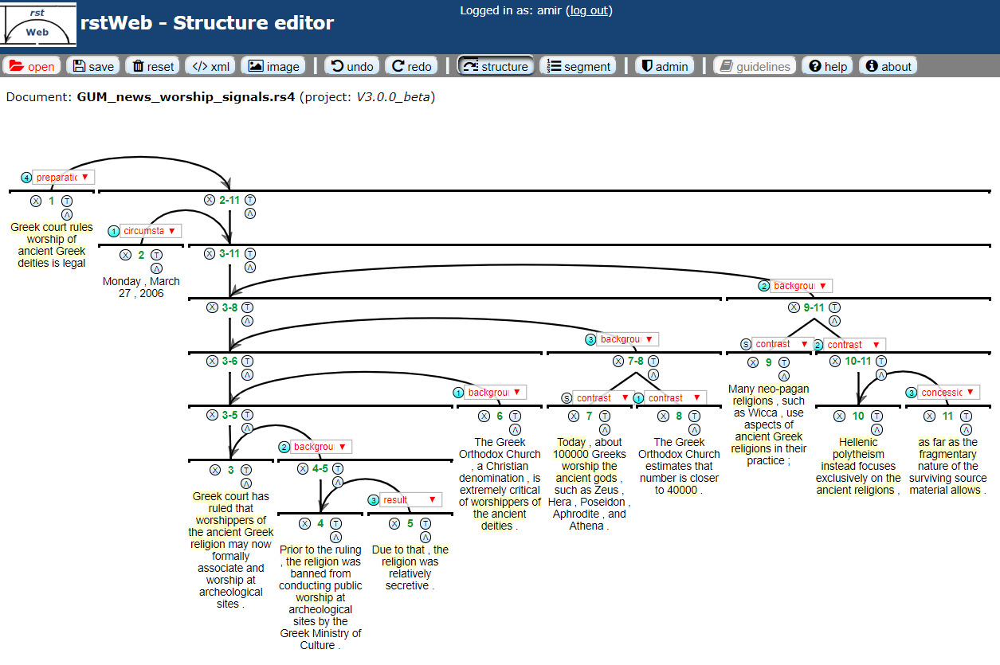

# rstWeb

Repository for rstWeb, a browser based annotation interface for Rhetorical Structure Theory

URL: https://corpling.uis.georgetown.edu/rstweb/info/



## Introduction

rstWeb is an open source, browser based annotation tool for discourse analyses in Rhetorical Structure Theory and annotation of discourse relation signals, such as connectives / discourse markers. It is meant to support collaborative, online annotation projects using just a Web browser, without the need to install software for annotators, though there is also a standalone local version for offline use if you do not have access to a server. 

## Local Installation

rstWeb runs in your browser no matter what, but you can run a local version of the software that emulates a Web server on your own machine. Getting this to work is a little different in Windows and Mac/Linux, and primarily requires Python and the library cherrypy to be installed (for Linux, replace your package repository for the Mac’s easy_install, i.e. apt-get, yum etc. depending on your Linux flavor). If you want to use screenshots in the interface, you will also need to install Selenium, which works with PhantomJS to create screenshots (see below). Alternatively, you can use your browsers print to PDF functionality directly.

1.	Make sure Python 2.X is installed (2.6 or newer; 3.X is also supported but less tested):
  * For Mac, Python is typically installed by default, no need to do anything
  * For Windows, download and install Python from https://www.python.org/ 
2.	The Python packages cherrypy and selenium must be installed if they aren’t already: (selenium is only required for exporting screenshots, you can skip it if not needed)
  * For Mac, you may need to install pip first, by opening a terminal and typing:
```
  sudo easy_install pip
```
  * Enter your password, and once pip is installed, run these commands:
```
  sudo pip install cherrypy
  sudo pip install selenium
```
  * On Windows, pip is installed by default with Python, so you should only need to open a command line (Start menu -> run -> cmd) and type:
```
  pip install cherrypy
  pip install selenium
```
3.	Unpack all of the files from the rstWeb repository in Github to some folder
4.	Run the appropriate script: 
  * On Mac/Linux: run rstweb_local.sh 
  * On Windows: run rstweb_local.bat 
5.	You can now use rstWeb in your browser at: http://127.0.0.1:8080/ 

If you run into problems getting the software to run, please check the PDF user guide in this repo first, then contact amir.zeldes@georgetown.edu 

## Server Installation

1.	Make sure Python 2.X is installed (2.6 or newer; 3.X is also supported but less tested)
2.	Unpack all of the files from rstWeb to the directory they will be served from
3.	Configure your Web server to have read, write and execute privileges within this folder
4.	Make sure selenium is installed (e.g. via pip), otherwise screenshots won’t work
5.	You may want to forbid users from interacting with files other than the top level python scripts in the main rstWeb directory (in particular, no one should have access to the configuration files)
6.	You will also want to disallow or simply delete the local version’s launch script, start_local.py, since server users shouldn’t be able to use it. You may also remove the .bat and .sh scripts.
7.	If you’re using Apache, here is a possible configuration file:

```
Alias "/rstweb" "/var/www/html/rstweb"
<Directory "/var/www/html/rstweb/">

RewriteEngine On
RewriteBase /
DirectoryIndex open.py

<IfModule mime_module>
AddType application/x-httpd-py .py
</IfModule>

RedirectMatch 404 ".+\.(py(c|o)|db|txt|rs3|ini)$"
RedirectMatch 404 ".*/(modules|export|import|templates|users).*$"

AddType text/html *
Options Indexes FollowSymLinks MultiViews
Options +FollowSymLinks
Options +ExecCGI
AddHandler cgi-script .py
AllowOverride None
Order allow,deny
allow from all
</Directory>
``` 
8.	Use the administration interface to change the passwords/user names to secure your system. The initial administrator password is ‘pass1’.
9.	You’re all set! 

## Usage with Docker

This option is primarily useful for sys admins automating deployment of rstWeb (or multiple instances of rstWeb), if you are running an operating system supporting docker. You can install rstWeb in a docker container using the following steps. 

Note that current docker releases do not support **RHEL 6** and that there are some known conflicts if you are running **SELinux**. Under those circumstances running over the normal apache server is recommended.

1.  Build docker container.
```
cd docker
./build.sh
```
2.  Run docker container. The default port in script is 8085
```
cd ../
./start_docker.sh
```
3.  You can now use rstWeb in your browser at: http://127.0.0.1:8085/rstweb/open.py

## Troubleshooting

If you’re having trouble, it’s possible some permissions are set incorrectly, or that your server needs to be configured to execute the Python scripts. Otherwise, the entry point for the program is the script open.py. If you’re using the Apache configuration above, this acts as the directory index, so you can simply direct users to `http://.../<rstwebsdirectory>/`. 

### Upgrading

If you have upgraded from an older version of rstWeb, it is recommended to click on admin -> database -> update schema (NOT ‘init DB’). This should not result in data loss, but backing up the rstweb.db is always a good idea. If new features are not working, you should also empty your browser cache to reload all css and javascript updates.

## Citing

If you're using rstWeb to annotate RST trees for a project or article, please cite the following paper:

Zeldes, Amir (2016) [rstWeb - A Browser-based Annotation Interface for Rhetorical Structure Theory and Discourse Relations](https://www.aclweb.org/anthology/N16-3001). In: Proceedings of NAACL-HLT 2016 System Demonstrations. San Diego, CA, 1-5.
```
@InProceedings{,
  author    = {Amir Zeldes},
  title     = {{rstWeb} - A Browser-based Annotation Interface for Rhetorical Structure Theory and Discourse Relations},
  booktitle = {Proceedings of NAACL-HLT 2016 System Demonstrations},
  year      = {2016},
  address   = {San Diego, CA},
  pages     = {1--5}
}
```

If you are using the system to annotate discourse relation signals, use this paper instead:

Gessler, Luke, Yang Liu and Amir Zeldes (2019) [A Discourse Signal Annotation System for RST Trees](https://www.aclweb.org/anthology/W19-2708). In: Proceedings of Discourse Relation Treebanking and Parsing (DISRPT 2019). Minneapolis, MN, 56-61.
```
@InProceedings{,
  author    = {Luke Gessler and Yang Liu and Amir Zeldes},
  title     = {A Discourse Signal Annotation System for {RST} Trees},
  booktitle = {Proceedings of Discourse Relation Treebanking and Parsing (DISRPT 2019)},
  year      = {2019},
  address   = {Minneapolis, MN},
  pages     = {56--61}
}
```

